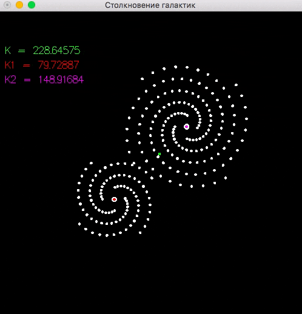

# demo-galaxies

Моделирование столкновения галактик при помощи системы частиц.



## Сборка и запуск

Клонируйте репозиторий:

```
git clone https://github.com/cmc-haskell-2017/demo-galaxies.git
cd demo-galaxies
```

Соберите проект при помощи [утилиты Stack](https://www.haskellstack.org):

```
stack setup
stack build
```

Собрать проект и запустить симулятор можно при помощи команды

```
stack build && stack exec demo-galaxies
```

## Задание

В качестве задания к [лекции «Функции высшего порядка. Функция `map`»](https://youtu.be/O6FTqv2aPSg) требуется
реализовать [функцию `angularMomentum`](https://github.com/cmc-haskell-2017/demo-galaxies/blob/master/src/Demo.hs#L8).

В проекте присутствует визуализация углового момента.
Как только вы реализуете функцию `angularMomentum`, визуализация проявится.
